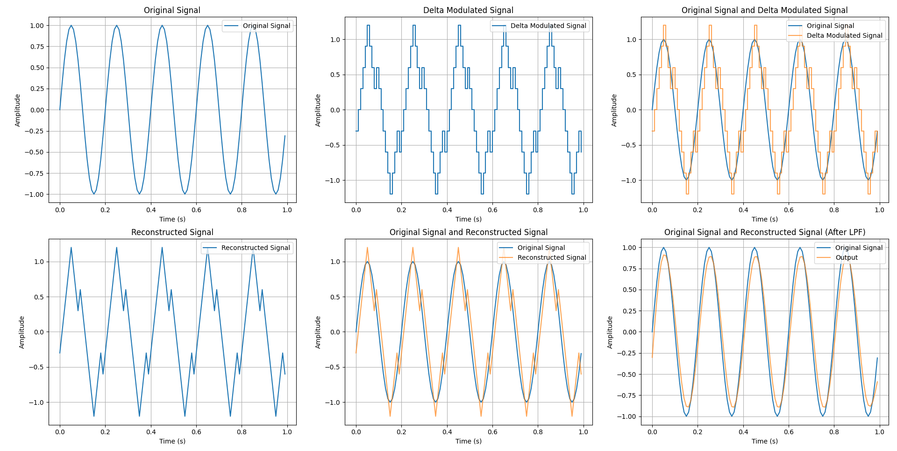

# **Delta Modulation and Demodulation**

This repository demonstrates the implementation of **Delta Modulation (DM)** and **Delta Demodulation (DD)** using Python. Delta Modulation is a method for digitizing analog signals, particularly suited for low-bandwidth communication systems. The project also includes signal reconstruction with a Low-Pass Filter (LPF) to improve accuracy.

## **Example Results**

Below is an example output from the Delta Modulation and Demodulation process:



---

## **Features**

- **Delta Modulation**: Encodes analog signals into a binary sequence using a fixed step size.
- **Delta Demodulation**: Decodes the binary sequence to reconstruct the original signal.
- **Low-Pass Filtering**: Smooths the reconstructed signal to remove high-frequency noise.
- **Visualization**:
  - Original signal.
  - Delta modulated signal.
  - Reconstructed signal (before and after LPF).
  - Signal comparisons (original vs. reconstructed).

---

## **How It Works**

### **Delta Modulation**
1. Compares the current input signal with the last quantized value.
2. Outputs `1` if the input is larger, adding a step size to the quantized value.
3. Outputs `0` if the input is smaller, subtracting a step size.
4. Generates a binary sequence and a staircase approximation of the signal.

### **Delta Demodulation**
1. Processes the binary sequence to reconstruct the signal.
2. Cumulatively adds or subtracts the step size based on the binary values.

### **Low-Pass Filtering**
1. Applies a Butterworth Low-Pass Filter to the reconstructed signal.
2. Removes high-frequency components, making the signal closely resemble the original.

---

## **Getting Started**

### **1. Clone the Repository**
```bash
git clone https://github.com/your-username/DeltaModulation-Demodulation.git
cd DeltaModulation-Demodulation
```

### **2. Install Dependencies**
Make sure Python and `pip` are installed. Install the required libraries:

```bash
pip install -r requirements.txt
```

### **3. Run the Script**
Execute the main script to visualize the Delta Modulation and Demodulation process:

```bash
python delta_modulation.py
```

### **4. Outputs**
The script generates the following plots:
- **Original Signal**
- **Delta Modulated Signal**
- **Reconstructed Signal**
- **Reconstructed Signal (after LPF)**
- **Signal Comparisons (Original vs. Reconstructed)**
